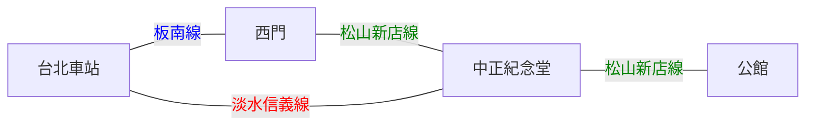

# 交通

## 平日生活
還是雙腳、UBike、捷運為大宗，太有錢或是遠離捷運的地方坐Uber、Yoxi，上來之前可以先弄好WeMO、GoShare、iRent帳號的設定，平常喜歡亂跑的有機車也可以寄上來，記得要申請全區車位。
## 來臺科
基本上是坐**火車**、**高鐵**、**客運**到**台北車站**，我自己是覺得貼個幾百可以舒舒服服的坐高鐵，Why not? (高鐵可以看大學生票，有打折) (高鐵可以用 T-EX行動購票 )
> 💡 【經驗分享】 
國慶返家，我比我北科朋友晚1小時上車(我搭高鐵、他搭客運)，結果我已經吃完消夜回到家了，他才剛下高速公路。

然後可以坐捷運
- 路線一：北車到西門轉到公館
  **板南線**
  **松山新店線**
- 路線二：北車到中正紀念堂轉到公館
  **淡水信義線**
  **松山新店線**
- 公館站從**二號出口**出來旁邊就是**台大舟山路校門**了

出公館站後的路可以走路或UBike(通常會走台大裡面)

【也可以參考Uber】

## YouBike
- 校門口公車站旁邊、二宿後面有站點
- 騎到公館站只要5塊錢
  - 30分內有搭過捷運就可以免錢(悠遊卡)
  - 30內有搭捷運，一樣可以減5元(悠遊卡)
  - 2025/07/18 Update: 目前Ubike應該是全面 **前30分鐘免費**
- 可以下載youbike2.0 APP查看！
- (**記得先登入悠遊卡號哦**)
## 臺科停車位
- 唯一建議，申請全區停車
- 才600元/學期(不香嗎?)
- [相關申請資訊(114-1學期)](https://www.general.ntust.edu.tw/p/406-1054-138102,r7.php?Lang=zh-tw)
## 華夏校區
- 學校有提供交通車，從公館校區定時發車至華夏校區
- 相關資訊請參考：[華夏校區交通方式](https://hwahsia-campus.ntust.edu.tw/p/412-1119-11723.php?Lang=zh-tw)
