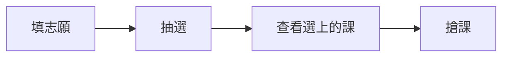

:::new
114 學年學生第二宿舍整修，新生（男生）都是住在第一宿舍喔～
:::

:::danger
被抓到在宿舍打麻將會被退宿，再想一下。
:::

## 選課流程

選課系統畢竟是給所有人用的，所以不會太難。==初選階段通識課最多只能選三門==，全校加退選階段就不限。詳細規則請看 [[course-select|選課篇]]。

:::steps
1. **排志願**：初選前三天到選課系統填志願序，上限 30 個
2. **抽選**：系統暫停選課 1~2 天進行志願序抽選
3. **看結果**：一天的時間查看自己中籤的課程
4. **搶課**：2~3 天的時間，先搶先贏
:::



:::tip
大一記得都要選==體育課跟國文課==。同一個時段可以放很多課進志願序，不用擔心重複中籤[^1]。
:::

[^1]: 當一個時段中籤後，系統會自動捨棄同時段與同課名的其他志願。

## 怎麼從台北車站到台科

::::tabs
:::tab[路線一：走西門]
**板南線** 台北車站 → 西門，轉 **松山新店線** → 公館，從**二號出口**出來就是台大舟山路校門。
:::
:::tab[路線二：走中正紀念堂]
**淡水信義線** 台北車站 → 中正紀念堂，轉 **松山新店線** → 公館。
:::
::::

## 校內 ATM

| 地點 | 銀行 ATM |
|---|---|
| 7-11（學生社團大樓 1F） | 中國信託 |
| 全家（第三學生餐廳 B1） | 國泰世華銀行 |
| 萊爾富（第一學生宿舍 1F） | 國泰世華銀行 |

## 入住檢查清單

- [x] 戶籍謄本（**有詳細記事的**，不然無法入住）
- [x] 繳費證明預先下載
- [ ] 網路線、延長線
- [ ] ~~整卡車的家當~~ 上去再買就好

:::spoiler[經歷分享：宿舍打麻將的下場]
有人在宿舍開局打麻將，結果宿管阿杯剛好上來貼資料，然後就 GG 了。
:::

::yt{id="kTR4vX3KBHs" title="宿舍介紹影片 - 二三宿"}

## 宿舍網路設定

```bash title="測試宿網連線" {2}
ping 140.118.1.1
ipconfig getifaddr en0   # 拿到 140.118 開頭的 IP 就是成功
```

連上 NTUST-PEAP 後按 :kbd[⌘] + :kbd[R] 重新整理登入頁。相關申請請看 :year[114] 的[全區停車資訊](https://www.general.ntust.edu.tw/p/406-1054-138102,r7.php?Lang=zh-tw)。

## 常用工具

::card[myNTUST]{href="https://myntust.com" desc="查空教室、考古題、GPA 分布"}
::card[Crosslink]{href="https://www.crosslink.tw" desc="課程評價查詢"}

## 新生常見問答

:::qa[系學會會費一定要繳嗎？]{by="Yu-chen Kuo" date="2025-08-24"}
不一定，依照個人意願繳交即可。
:::

:::qa[志願序最多幾個？]{by="FongHen" date="2025-08-13"}
30 個，可以超過 25 學分，滿 25 學分會自動停止抽選。
:::


