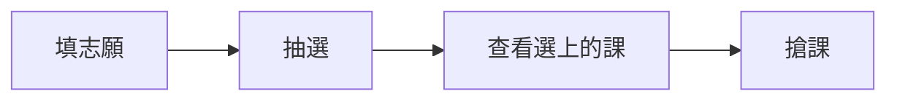

## 前言

選課系統畢竟是給所有人用的，所以不會太難。選哪些課請自己去[GPA網站](https://myntust.com)或是Dcard等查詢哪些課比較涼，通識課的主要目的除了學習內容之外是洗GPA跟認識新同學。
如果想查詢其他人對課程的評價，可以到[CrossLink](https://www.crosslink.tw/)上面查詢，挑個涼課，大學爽爽過。

:::tip
大一記得都要選體育課跟國文課。
:::

### 修課相關規定

- [連結](https://www.academic.ntust.edu.tw/p/412-1048-8230.php?Lang=zh-tw)
- 每個學年度入學的規定不一定會相同，在你開始選課前你應該要看過
- 範例：[114學年入學 "校定" 必修](https://www.academic.ntust.edu.tw/var/file/48/1048/img/2570/355722331.pdf)

## 學分限制

- 選課學分限制 16~25／學期
- 每學期最低必須選到 16 學分（但沒選到好像也只是不排名而已）
- 最高可選到 25 學分，如果前一學期 GPA 有達標（大概是 3.38），最多可超修至 31 學分（在全校加退選階段才可以超修）
- ==初選階段（含搶課），通識課程最多只能選三門==，全校加退選階段就不限

:::warning
雖然學校沒硬性規定一定要修到 16 學分，但如果**沒修到最低學分，會不排班排**，這會影響到你之後推碩班，而且如果你前面學分修太少，後面幾個學期會補學分補得很辛苦！
**建議每學期選 18~22 個學分**，就可以涼涼過了。
:::

## 選課系統

- 選課期間，系統上的人數會是顯示將這門課加入志願序的人數，可以利用這個來調整你的志願序
- **同課名、同時間的課就是要你選老師**
- 有些通識課在初選（填志願階段）有**班級限制**，你可以先找到你們班級優先選的課，這樣一定會抽到通識課
- 如果課程查詢系統中，**選課總人數和備註欄裡面的上限人數相同**，代表那門課已經被選滿了，就不用再把他加進去志願序了
- [選課系統操作手冊](https://www.academic.ntust.edu.tw/var/file/48/1048/img/2563/627618988.pdf)

### 志願序抽選

- 蠻複雜的大致重點只有幾個
  - 課程中簽後，系統會自動把在志願序中同課名和撞時間的其他課 ban 掉
  - 所以填越多越好（上限好像是 30 個志願的樣子）
  - 體育和國文千萬不要只填一門課（很容易沒抽到）
- [志願序抽選規則](https://www.academic.ntust.edu.tw/var/file/48/1048/img/2563/544158721.ppsx)：有點複雜，但如果看懂他是如何抽選的還蠻有用的

:::tip
同一個時段可以放很多課進去志願序裡面，不用擔心重複中籤。
:::

## 初選階段

俗稱比運氣環節。填志願用抽的，基本上較熱門的課不放第一是不會上的，就是可以多填一些，選到不喜歡的可以之後再退。

:::steps
1. **排志願**：初選前三天到選課系統排志願表
2. **抽選**：系統暫停選課 1~2 天進行志願序抽選
3. **看結果**：一天的時間去看自己選到了哪些課，順便查還沒滿的課
4. **搶課**：2~3 天的時間，先搶先贏
:::

## 加退選

用肝換課環節。線上加退選課，名額先搶先贏，基本上好的課都會維持滿的，要靠人品在別人退課的時候加選到，這個階段基本上有付出不一定有收穫。這段時間很長，基本上會一直到開學前兩週，可以去上看看再決定要不要把課退掉。

## 加簽

俗稱跪教授環節。開學前兩週可以找教授加簽課程，可以先寄信詢問教授是如何給授權碼的，通常會要你去該堂課程的第一次上課。有些教授會有加簽的規定，諸如大四以上優先、加簽前要先交心得…etc

### 授權碼

- 一個很神奇的東西，當你跪完教授，如果教授開心就會給你的一串神奇小文字
- 白話文：你有課上了啦
- 到選課系統中輸入授權碼，這門課就會直接跑進你的課表了

:::danger
領授權碼時，教授會要你**簽名**，這張授權碼就是給簽名名字的那個人，**不能轉讓給其他人**。如果被發現授權碼被轉讓，教授**有權直接把你退選**！
:::

## 台大系統選課

- 台大系統選課初選階段**沒有開放新生選課**
- 新生只能在全校加退選階段進行台大系統的選課！

## 選課常見問題

:::qa[志願序最多幾個？]
30 個。
:::

:::qa[會不會重複中簽（同個時段中兩門課）？]
不會，當一個時段有課的時候，其他同時段的志願序會被直接捨棄。
:::

:::qa[抽選後會不會超過 25 學分？]
不會，滿 25 學分會自動停止抽選。
:::

:::qa[加入志願序的時候顯示課程已達人數上限怎麼辦？]
這代表這門課已經被舊生選滿了，等看看加退選階段有沒有人退課，再進行加選。
:::

## 其他資料

- [選課須知與時程](https://www.academic.ntust.edu.tw/p/412-1048-8580.php?Lang=zh-tw)：查詢每學期選課事務相關的時程
- [大學部選課專區](https://www.academic.ntust.edu.tw/p/412-1048-8230.php?Lang=zh-tw)：各系畢業學分、雙主修輔系、校際選課資訊
- [大學部選課推薦系統（臺科大教務處建置）](https://academicgaa.ntust.edu.tw/Home/Index)

## 小撇步

通常在抽選的最後一天下午，就可以透過一些方法來看有沒有選到課了。

:::spoiler[兩種偷看抽選結果的方法]
- **第一種方法**：課程查詢系統中，先把待選清單（你有填入志願表的課）記下來，然後清空，接著一個個去按你填入志願表之課程後面的＋號，如果系統顯示 **「無法加入待選清單」、「這門課你正在修習中」**，那八成就是有選到了
- **第二種方法**：去看 [Moodle](https://moodle2.ntust.edu.tw/) 中**有沒有出現課程**，九成以上就可以確定有選上
:::

## 實用工具

::card[GPA 計算機]{href="https://college-gpacalculator.vercel.app/" desc="by Vic Wen，計算學期 GPA"}
::card[myNTUST]{href="https://myntust.com/" desc="查空教室、考古題、GPA 分布"}
