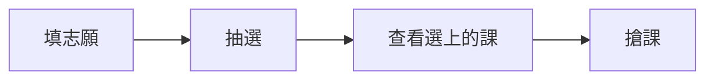

## 標題階層

這行是 H2 底下的一般段落。H2 帶分類色底線，往下還有兩級：

### H3 帶色點的小節

H3 開頭有一顆分類色圓點，適合放流程中的子主題。

#### H4 低調的細項標題

H4 是最小層級，字級貼近內文、色調偏分類色，適合補充性的細分段（不會進右側目錄）。

## 行內語法

- 螢光筆：==初選階段通識課最多只能選三門==
- 按鍵：按 :kbd[⌘] + :kbd[R] 重新整理登入頁
- 年度標記：:year[115] 的全區停車申請
- 站內連結：詳細規則請看 [[course-select|選課篇]]
- 行內程式碼：`ipconfig getifaddr en0`，外部連結：[選課系統](https://courseselection.ntust.edu.tw/)
- 註腳：志願序上限 30 個[^1]，滑鼠移到編號上可以直接預覽內容[^2]

[^1]: 當一個時段中籤後，系統會自動捨棄同時段與同課名的其他志願。
[^2]: 這就是註腳的 hover 即時預覽，不用點下去再跳回來。

## 提示區塊

:::info
一般補充說明。
:::

:::tip
大一記得都要選==體育課跟國文課==。
:::

:::warning[自訂標題也可以]
沒修到最低學分會不排班排，會影響之後推碩班。
:::

:::danger
被抓到在宿舍打麻將會被退宿，再想一下。
:::

:::fatal
重大事項：114 學年學生第二宿舍整修，新生（男生）都住第一宿舍。（`:::critical` 是同義別名）
:::

## 摺疊區塊

:::spoiler[經歷分享：宿舍打麻將的下場]
有人在宿舍開局打麻將，結果宿管阿杯剛好上來貼資料，然後就 GG 了。
:::

:::spoiler[預設展開的寫法]{open}
在標籤後面加 `{open}` 就會預設展開。
:::

## 問答區塊

:::qa[系學會會費一定要繳嗎？]{by="Yu-chen Kuo" date="2025-08-24"}
不一定，依照個人意願繳交即可。
:::

:::qa[志願序最多幾個？]
30 個，可以超過 25 學分，滿 25 學分會自動停止抽選。
:::

## 分頁

::::tabs
:::tab[路線一：走西門]
**板南線** 台北車站到西門，轉 **松山新店線** 到公館，從**二號出口**出來就是台大舟山路校門。
:::
:::tab[路線二：走中正紀念堂]
**淡水信義線** 台北車站到中正紀念堂，轉 **松山新店線** 到公館。
:::
::::

## 步驟時間軸

預設樣式（跟隨分類色的圓形站點）：

:::steps
1. **排志願**：初選前三天到選課系統填志願序，上限 30 個
2. **抽選**：系統暫停選課 1 到 2 天進行志願序抽選
3. **看結果**：一天的時間查看自己中籤的課程
4. **搶課**：2 到 3 天，先搶先贏
:::

指定顏色與方形站點（`:::steps{color="#7c3aed" shape="square"}`）：

:::steps{color="#7c3aed" shape="square"}
1. 戶政申請**戶籍謄本**（要有詳細記事）
2. 下載繳費證明
3. 入住當天到宿舍櫃台報到
:::

菱形站點（`:::steps{shape="diamond" color="#0e7490"}`）：

:::steps{shape="diamond" color="#0e7490"}
1. 寄信詢問教授加簽方式
2. 出席該課程第一次上課
3. 拿到授權碼後到選課系統輸入
:::

## 連結卡片

::card[myNTUST]{href="https://myntust.com" desc="查空教室、考古題、GPA 分布"}
::card[Crosslink]{href="https://www.crosslink.tw" desc="課程評價查詢"}

右側帶示意圖片的寫法（`img` 屬性）：

::card[公館站步行路線]{href="https://www.google.com/maps/dir/Gongguan+Station,+Taipei/NTUST" desc="二號出口出來就是台大舟山路校門，穿過台大約十分鐘" img="https://i.imgur.com/i9qq6ut.jpg"}

## YouTube 影片

::yt{id="kTR4vX3KBHs" title="宿舍介紹影片 - 二三宿"}

## 程式碼區塊

標題加行號反白（`title="..." {2}`）：

```bash title="測試宿網連線" {2}
ping 140.118.1.1
ipconfig getifaddr en0
echo "拿到 140.118 開頭的 IP 就是成功"
```

顯示行號（`showLineNumbers`）：

```python title="parse_ics.py 節錄" showLineNumbers {3-4}
def unfold(text):
    return re.sub(r"\r?\n[ \t]", "", text)

def parse_date(value):
    value = value.split("T")[0]
    return date(int(value[:4]), int(value[4:6]), int(value[6:8]))
```

不帶任何參數就是乾淨的預設樣式：

```js
const depts = ['all', 'csie'];
```

## Mermaid 圖表



## 表格與清單

基本表格：

| 地點 | 銀行 ATM |
|---|---|
| 7-11（學生社團大樓 1F） | 中國信託 |
| 全家（第三學生餐廳 B1） | 國泰世華銀行 |
| 萊爾富（第一學生宿舍 1F） | 國泰世華銀行 |

欄位對齊（`:---` 靠左、`:---:` 置中、`---:` 靠右）：

| 項目（靠左） | 學分（置中） | 費用（靠右） |
|:---|:---:|---:|
| 學生會費 | — | 300 |
| 宿舍保證金 | — | 2000 |
| 通識課 | 15 | 0 |

垂直框線（用 `:::table{vlines}` 包住表格）：

:::table{vlines}
| 週次 | 一 | 二 | 三 |
|:---:|:---:|:---:|:---:|
| 第 9 節 | 體育 | — | 國文 |
| 第 10 節 | 體育 | — | — |
:::

入住檢查清單：

- [x] 戶籍謄本（**有詳細記事的**）
- [x] 繳費證明預先下載
- [ ] 網路線、延長線
- [ ] ~~整卡車的家當~~ 上去再買就好

> 引用區塊：這裡是台北市欸，美食到處都是。

---

上面是分隔線。

## 圖片與說明


## 系別限定內容

下面這段只有在右上角系別選「資工系」時才會顯示：

:::dept{for="csie"}
資工系新生請先追蹤系學會 Instagram（ntustcsie），系上迎新與課程公告都會在那裡發布。
:::
