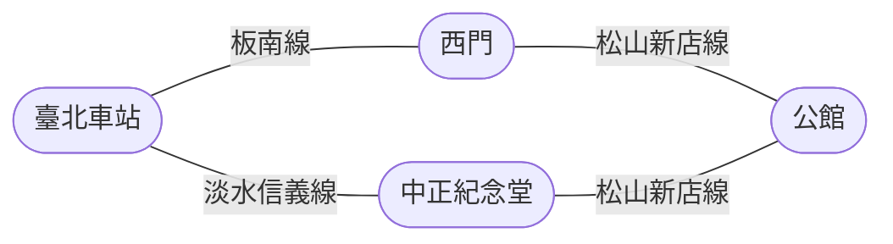

## 第一次來臺科

外縣市的同學通常是搭**火車、高鐵或客運**到臺北車站，再轉捷運到**公館站**。

:::spoiler[經驗分享：高鐵 vs 客運]
國慶連假返家，我搭高鐵、北科的朋友搭客運，我比他晚一小時上車。結果我已經吃完宵夜回到家了，他才剛下高速公路。

貼幾百塊買舒服跟時間，我覺得划算。高鐵有**大學生票**優惠，用 T-EX 行動購票 App 訂票也常有折扣。
:::

### 捷運怎麼轉

::::tabs
:::tab[路線一：走西門]
**板南線**（往頂埔方向）臺北車站 → 西門，站內轉 **松山新店線**（往新店方向）→ 公館
:::
:::tab[路線二：走中正紀念堂]
**淡水信義線**（往象山方向）臺北車站 → 中正紀念堂，站內轉 **松山新店線**（往新店方向）→ 公館
:::
::::

兩條路線時間差不多，看你在臺北車站站在哪個月台比較近就選哪條。

### 出公館站之後

從**二號出口**出來，旁邊就是臺大舟山路校門。接下來可以走路（穿過臺大校園）或騎 YouBike，大約 10 到 15 分鐘。

:::tip
第一次來、又拖著行李的話，直接叫車比較實際。公館站到臺科校門口的計程車或 Uber 車資大約 70 元起跳，入住當天行李多，這錢花得值得。
:::

## 平日通勤

日常移動的主力是**雙腳、YouBike 與捷運**。住得遠或懶得動的時候才叫 Uber、Yoxi。

上臺北之前可以先把這些帳號設定好，到現場才不會手忙腳亂：

- 共享機車：WeMO、GoShare
- 共享汽車：iRent
- 叫車：Uber、Yoxi

有自己的機車也可以騎上來，記得申請停車位（見下方）。

## YouBike

- 站點：校門口公車站旁邊、第二宿舍後面都有
- 騎到公館站的費用極低，前 30 分鐘目前為免費（費率以[臺北市公共自行車官方公告](https://www.youbike.com.tw/region/taipei/)為準）
- 30 分鐘內有搭乘捷運的話，還可以享有轉乘優惠
- 下載 YouBike 2.0 App 可以即時查看各站可借與可還車輛數

:::warning
==記得先在 App 或官網登錄悠遊卡號==，沒綁定的卡片刷不了車。這是最多人第一次要騎的時候才發現的問題。
:::

## 機車停車位

- 唯一建議：申請**全區停車**
- 費用約 600 元／學期，以臺北市的行情來說非常划算
- 申請時程與辦法每學期公告一次，見[總務處相關公告](https://www.general.ntust.edu.tw/p/406-1054-138102,r7.php?Lang=zh-tw)

:::info
上面的連結為往年公告，==每學期的申請時間與費用請以總務處當學期最新公告為準==。
:::

## 華夏校區

部分課程與單位在新北中和的華夏校區。學校有提供交通車，從公館校區定時發車。

::card[華夏校區交通方式]{href="https://hwahsia-campus.ntust.edu.tw/p/412-1119-11723.php?Lang=zh-tw" desc="交通車時刻表與大眾運輸路線說明"}

## 常見問題

:::qa[需要買機車嗎？]
不一定。校本部在公館，生活圈走路與捷運就能覆蓋。喜歡跑遠一點、或常回外縣市的人才比較需要。
:::

:::qa[腳踏車要牽上來嗎？]
校內與周邊 YouBike 站點密集，除非你有特別想騎的車，不然直接用 YouBike 更省事，也不用煩惱宿舍區停放與失竊問題。
:::
